# John Liao
**Computer Science @ University of Waterloo** | **Machine Learning & Autonomy**

---

## 👤 Who am I?
I am a __risk-taker__. I'm the type of guy to throw myself into a fire, a new hobby, or in front of a crowd of strangers, as long as I it makes me a better version of myself. Haters might call me a masochist, but I think improvement is sexy. Feel free to reach out!

---

## 🔴 Operational Status
- 🔬 **Machine Learning Researcher @ WAT.ai:** Researching the usage of Vision-Language Models to developing preference feedback data pipelines for robot manipulation.
- ⚙️ **Current side project:** Developing Reinforcement Learning agents using **PyTorch** to optimize drone stabailization against high-frequency recoil in a **MuJoCo** environment. 

---

## 🛠️ Technical Architecture

**Core Languages**

**Machine Learning & Simulation**

**Systems & Web**

---

## 📊 Telemetry

